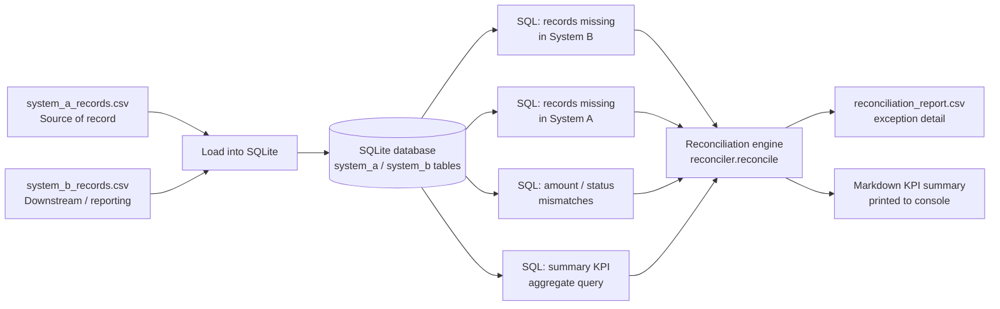

# SQL Data Reconciliation Toolkit

A small, dependency-light toolkit that reconciles records between two
financial-operations data sources -- a **source of record** system and a
**downstream / reporting** system -- and produces an auditable exception
report plus summary KPIs, entirely offline using SQLite and hand-written
SQL.

> **Disclaimer:** This is an independently written, representative
> portfolio project built entirely with synthetic data. It does not
> contain, reproduce, or reference any employer's proprietary code,
> data, or systems.

---

## Business use case

Anywhere financial data flows from a system of record into a second
system -- a general ledger feeding a billing statement, a policy master
file feeding a reporting data mart, a payments ledger feeding a
downstream settlement report -- the two copies drift apart over time.
Feed lag, partial loads, re-statements, and status updates that don't
propagate all create silent discrepancies. A Business Analyst supporting
financial operations is routinely asked to answer:

- Which records exist on one side but not the other?
- Which records exist on both sides but disagree on amount or status?
- How many dollars are "in exception," and how many records does that
  represent?

This toolkit automates that reconciliation end to end: it loads two CSV
extracts into a local SQLite database, runs SQL against them to detect
each discrepancy type, and exports a ready-to-review exception report
with headline KPIs -- the same shape of deliverable a BA would hand to
an operations or finance team during a month-end close or a data-quality
investigation.

The two sides are named generically -- **System A** (source of record)
and **System B** (downstream / reporting) -- so the toolkit applies to
any financial-operations reconciliation, not a specific industry or
vendor system.

---

## Architecture



---

## Tech stack

| Layer | Choice | Why |
|---|---|---|
| Language | Python 3.10+ | Standard tooling for a BA-adjacent data toolkit |
| Data store | SQLite (`sqlite3`, stdlib) | Zero setup, fully offline, real SQL engine |
| CLI | `argparse` (stdlib) | No extra dependency for a simple two-command interface |
| Data generation | `csv` + `random` (stdlib) | Reproducible synthetic data via a fixed seed |
| Testing | `pytest` | Fixture-driven unit + end-to-end tests |
| Packaging | Plain `reconciler` package, `python -m reconciler` | Runnable without installation |
| Containerization | Docker (`python:3.11-slim`) | One-command reproducible run |
| CI | GitHub Actions | Installs deps, runs the test suite and a pipeline smoke test on every push |

No network calls, no external database server, and no third-party
runtime dependency are required -- the whole pipeline runs from a clean
checkout.

---

## Repository layout

```
sql-data-reconciliation-toolkit/
├── data/                        # Committed synthetic sample CSVs (ready to run)
│   ├── system_a_records.csv
│   └── system_b_records.csv
├── scripts/
│   └── generate_synthetic_data.py   # Regenerates the CSVs above (seeded, reproducible)
├── sql/                          # The actual SQL run by the reconciliation engine
│   ├── missing_in_b.sql
│   ├── missing_in_a.sql
│   ├── amount_mismatches.sql
│   ├── status_mismatches.sql
│   └── summary_kpis.sql
├── reconciler/                   # The application package
│   ├── db.py                     # SQLite connection + CSV loading + schema validation
│   ├── reconcile.py               # Runs the SQL, assembles exceptions + KPIs
│   ├── report.py                  # CSV export + Markdown KPI summary
│   ├── cli.py                     # argparse CLI (`run` command)
│   └── __main__.py                # `python -m reconciler` entry point
├── tests/                        # pytest suite (unit + end-to-end)
├── out/                          # Report output (gitignored)
├── Dockerfile
└── .github/workflows/ci.yml
```

---

## Installation

```bash
git clone <this-repo-url>
cd sql-data-reconciliation-toolkit

python3 -m venv .venv
source .venv/bin/activate      # Windows: .venv\Scripts\activate

pip install -r requirements.txt
```

The `data/` folder already contains a committed, reproducible sample
dataset, so you can run the toolkit immediately without generating
anything.

---

## Usage

### 1. (Optional) regenerate the synthetic sample data

The committed CSVs in `data/` were produced by this script with
`--seed 42`; re-running it reproduces them exactly:

```bash
python scripts/generate_synthetic_data.py --num-records 300 --seed 42 --output-dir data
```

### 2. Run the reconciliation

```bash
python -m reconciler run \
    --source-a data/system_a_records.csv \
    --source-b data/system_b_records.csv \
    --output out/reconciliation_report.csv
```

### Sample output (actual captured run)

```
2026-09-21 17:52:05 [INFO] reconciler.db: Loaded 300 rows from data/system_a_records.csv into table 'system_a'
2026-09-21 17:52:05 [INFO] reconciler.db: Loaded 294 rows from data/system_b_records.csv into table 'system_b'
2026-09-21 17:52:05 [INFO] reconciler.reconcile: Reconciliation complete: 309 compared, 243 matched, 66 exceptions, $772.19 total variance
2026-09-21 17:52:05 [INFO] reconciler.report: Wrote 66 exception rows to out/reconciliation_report.csv
## Reconciliation Summary

| KPI | Value |
|---|---|
| Total records compared | 309 |
| Matched records | 243 |
| Exceptions | 66 |
| Missing in System B | 15 |
| Missing in System A | 9 |
| Amount mismatches | 24 |
| Status mismatches | 18 |
| Total $ variance | $772.19 |

Exception detail written to: out/reconciliation_report.csv
```

### Sample exception rows (from the actual `reconciliation_report.csv`)

| record_id | exception_type | account_id | amount_a | amount_b | status_a | status_b | variance |
|---|---|---|---|---|---|---|---|
| TXN-00031 | AMOUNT_MISMATCH | ACC-1541 | 1218.02 | 1287.19 | SETTLED | SETTLED | 69.17 |
| TXN-00002 | STATUS_MISMATCH | ACC-1228 | 682.69 | 682.69 | SETTLED | PENDING | 0.00 |
| TXN-00003 | MISSING_IN_B | ACC-1089 | 2840.51 | | SETTLED | | 2840.51 |
| TXN-00301 | MISSING_IN_A | ACC-1360 | | 2442.61 | | SETTLED | 2442.61 |

### 3. Run the test suite

```bash
pytest -v
```

### 4. Run with Docker

```bash
docker build -t sql-reconciliation-toolkit .
docker run --rm -v "$(pwd)/out:/app/out" sql-reconciliation-toolkit
```

---

## The SQL, as actually used

The reconciliation engine loads and executes these files directly from
`sql/` (see `reconciler/reconcile.py`) -- they are not just inline
strings buried in Python.

**Records in System A missing from System B** (`sql/missing_in_b.sql`):

```sql
SELECT
    a.record_id,
    a.account_id,
    a.amount,
    a.status,
    a.last_updated_date
FROM system_a a
LEFT JOIN system_b b ON a.record_id = b.record_id
WHERE b.record_id IS NULL;
```

**Records in System B missing from System A** (`sql/missing_in_a.sql`)
is the symmetric query with the join reversed.

**Amount mismatches** (`sql/amount_mismatches.sql`):

```sql
SELECT
    a.record_id,
    a.account_id AS account_id_a,
    a.amount AS amount_a,
    b.amount AS amount_b,
    a.status AS status_a,
    b.status AS status_b,
    a.last_updated_date AS last_updated_a,
    b.last_updated_date AS last_updated_b
FROM system_a a
INNER JOIN system_b b ON a.record_id = b.record_id
WHERE ABS(a.amount - b.amount) > 0.01;
```

**Status mismatches** (`sql/status_mismatches.sql`) is the same join
with `WHERE a.status <> b.status`.

**Summary KPI aggregate** (`sql/summary_kpis.sql`) -- a single query
that computes every headline number in one pass using correlated
subqueries built from the same join logic:

```sql
SELECT
    (SELECT COUNT(*) FROM (
        SELECT record_id FROM system_a
        UNION
        SELECT record_id FROM system_b
    )) AS total_records_compared,
    (SELECT COUNT(*) FROM system_a a INNER JOIN system_b b ON a.record_id = b.record_id
        WHERE a.status = b.status AND ABS(a.amount - b.amount) <= 0.01) AS matched_records,
    (SELECT COUNT(*) FROM system_a a LEFT JOIN system_b b ON a.record_id = b.record_id
        WHERE b.record_id IS NULL) AS missing_in_b,
    (SELECT COUNT(*) FROM system_b b LEFT JOIN system_a a ON b.record_id = a.record_id
        WHERE a.record_id IS NULL) AS missing_in_a,
    (SELECT COUNT(*) FROM system_a a INNER JOIN system_b b ON a.record_id = b.record_id
        WHERE ABS(a.amount - b.amount) > 0.01) AS amount_mismatches,
    (SELECT COUNT(*) FROM system_a a INNER JOIN system_b b ON a.record_id = b.record_id
        WHERE a.status <> b.status) AS status_mismatches,
    (SELECT COALESCE(SUM(ABS(a.amount - b.amount)), 0) FROM system_a a
        INNER JOIN system_b b ON a.record_id = b.record_id
        WHERE ABS(a.amount - b.amount) > 0.01) AS total_amount_variance;
```

The full text of every query lives in `sql/` and is loaded verbatim by
`reconciler/reconcile.py` (`_load_sql`) at run time -- nothing above is
paraphrased.

---

## Synthetic data design

`scripts/generate_synthetic_data.py` builds System A as a population of
`record_id, account_id, amount, status, last_updated_date` rows, then
derives System B from it with a fixed `random.Random(seed)` instance so
output is byte-for-byte reproducible. It deliberately injects, as a
percentage of the population:

- **~5%** of records dropped from System B (not yet propagated downstream)
- **~3% extra** records added only to System B (e.g. a record System A
  later voided, but the downstream copy was never cleaned up)
- **~8%** amount mismatches (rounding drift / re-stated fees)
- **~6%** status mismatches (downstream status hasn't caught up)
- **~4%** stale `last_updated_date` values

All data is fictional and generated programmatically -- no real
transactions, accounts, or customer data are used anywhere in this
repository.

---

## Limitations & future enhancements

- **Exact-key matching only.** Reconciliation is keyed strictly on
  `record_id`; it does not attempt fuzzy/probabilistic matching for
  systems that don't share a common key.
- **Two-way reconciliation.** The toolkit compares exactly two sources;
  a three-way reconciliation (e.g. source, mart, and a downstream
  billing extract) would need an extended schema.
- **Flat amount tolerance.** The `0.01` mismatch tolerance is a fixed
  constant; a production version would likely make this configurable
  per field or per account type.
- **No historical trending.** Each run is a point-in-time snapshot;
  there's no persisted history of exception counts over time to show
  whether reconciliation health is improving or degrading.
- **Single-threaded CSV load.** Fine at this scale (hundreds to tens of
  thousands of rows); a much larger dataset would benefit from bulk
  loading (`sqlite3`'s `executemany`, chunked reads) or a proper
  warehouse-backed pipeline.
- **Planned enhancements:** an HTML report with sortable/filterable
  exception tables, a `--tolerance` CLI flag, support for additional
  comparable fields via a config file, and a persisted SQLite history
  table for trend reporting across runs.

---

## Security considerations

- **No external network calls.** The entire pipeline reads local CSV
  files and writes to a local SQLite database and local report files.
  Nothing is transmitted anywhere.
- **No real data.** Every row in `data/` is synthetically generated by
  `scripts/generate_synthetic_data.py` with a fixed seed; there is no
  real customer, account, or transaction data anywhere in this
  repository.
- **No credentials of any kind** are used, stored, or required to run
  this toolkit end to end.
- **If this became a real production tool** operating on actual
  financial or customer data, it would additionally need:
  - Field-level encryption at rest for the SQLite (or upgraded RDBMS)
    store, and TLS in transit if the sources were pulled from a network
    location instead of local files.
  - Role-based access control on who can run reconciliations and who
    can view the exception report, since the amounts and account
    identifiers involved are sensitive.
  - Masking or tokenization of account/customer identifiers in any
    report that leaves a controlled environment.
  - An audit trail of who ran which reconciliation, against which
    source snapshots, and when.
  - Secrets management (e.g. a vault service) for any real database
    credentials, rather than plaintext connection strings -- this
    toolkit's local-file design deliberately sidesteps that need for a
    portfolio demo.
  - Data retention and deletion policies for exception reports
    containing sensitive financial fields.

---

## License

MIT -- see [LICENSE](LICENSE).
